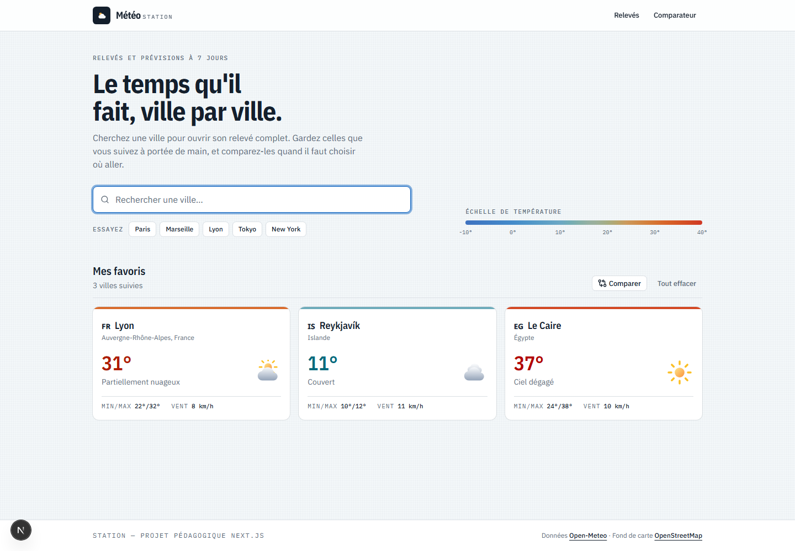
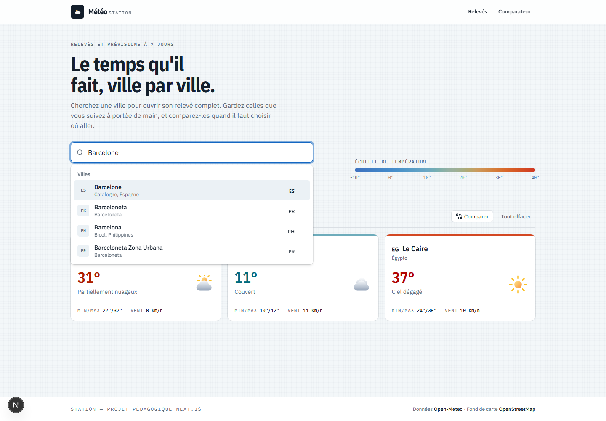
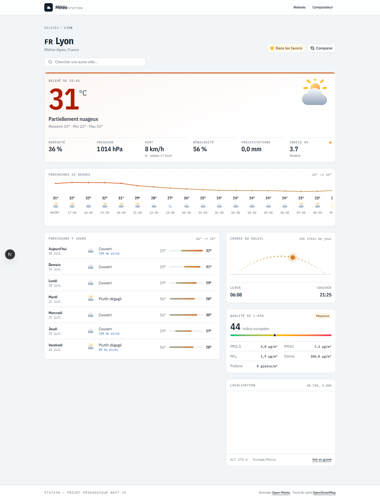
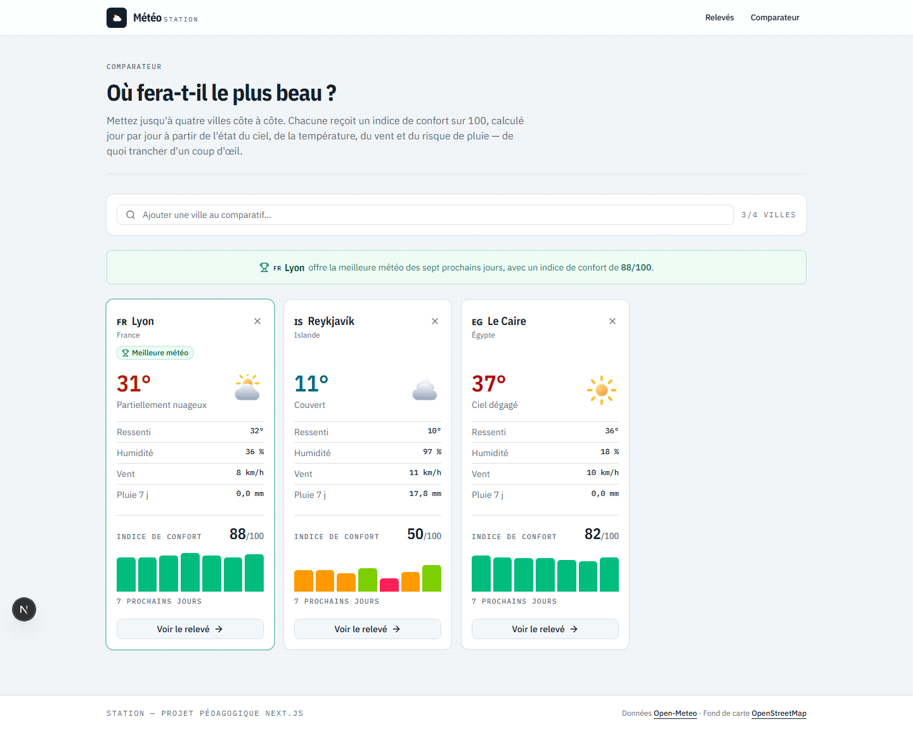
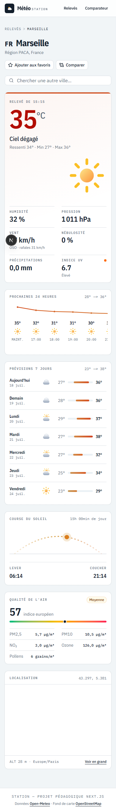

# Météo - application de prévisions, favoris et comparateur

Application web permettant de rechercher une ville, de consulter ses conditions
météorologiques actuelles et ses prévisions sur 7 jours, de gérer une liste de villes
favorites, et de **comparer plusieurs destinations** pour déterminer laquelle offre
la meilleure météo de la semaine.

Développée avec **Next.js 16 (App Router)**, **TypeScript**, **Tailwind CSS 4** et
**shadcn/ui**, à partir des APIs publiques et gratuites d'[Open-Meteo](https://open-meteo.com/).

> Aucune clé d'API n'est nécessaire : le projet fonctionne immédiatement après
> `npm install && npm run dev`.

---

## Sommaire

- [Captures d'écran](#captures-décran)
- [Fonctionnalités](#fonctionnalités)
- [Fonctionnalité originale : le comparateur](#fonctionnalité-originale--le-comparateur-de-villes)
- [Parti pris visuel](#parti-pris-visuel)
- [Technologies](#technologies-utilisées)
- [Installation et lancement](#installation-et-lancement)
- [Variables d'environnement](#variables-denvironnement)
- [Choix d'architecture](#choix-darchitecture)
- [Structure du projet](#structure-du-projet)

---

## Captures d'écran

### Page d'accueil - recherche et favoris



### Recherche avec suggestions en temps réel



### Détail d'une ville



### Fonctionnalité originale - comparateur de villes



### Rendu mobile



---

## Fonctionnalités

### Page d'accueil

- **Recherche de villes** avec suggestions en temps réel (géocodage Open-Meteo),
  navigation au clavier (`↑` `↓` `Entrée` `Échap`) et sémantique ARIA `combobox`.
- **Géolocalisation** : le bouton « Autour de moi » de la barre de recherche ouvre
  directement le relevé de la ville où se trouve l'utilisateur.
- **Affichage des favoris** : chaque vignette montre la température actuelle, l'état
  du ciel, les extrêmes du jour et le vent, avec accès direct à la fiche détaillée.
- **Historique des consultations** : les huit dernières villes ouvertes sont
  proposées en accès rapide, chacune retirable individuellement.
- **Villes suggérées** pour essayer l'application sans rien saisir.

### Page de détail - `/ville/[nom]`

- **Conditions actuelles** : température, ressenti, humidité, pression, vent
  (vitesse, direction cardinale, rafales), nébulosité, précipitations et indice UV.
- **Prévisions horaires** sur 24 h, avec courbe de température tracée en SVG.
- **Prévisions journalières** sur 7 jours : min/max, état du ciel, probabilité de
  pluie, et barre de température positionnée sur l'amplitude de la semaine pour
  rendre les journées comparables visuellement.
- **Lever et coucher du soleil**, avec la position courante de l'astre sur son arc
  et la durée du jour.
- **Qualité de l'air** (fonctionnalité additionnelle) : indice européen, PM2,5, PM10,
  NO₂, ozone et risque pollinique, via l'API Air Quality d'Open-Meteo.
- **Carte** OpenStreetMap centrée sur la ville, avec altitude et fuseau horaire.

### Gestion des favoris

- **Ajout / suppression** depuis la page de détail (bouton étoile) comme depuis les
  vignettes de la page d'accueil.
- **Persistance** dans le `localStorage`, conservée entre les sessions.
- **Indicateurs visuels** cohérents sur toutes les pages, et **synchronisation entre
  onglets** : ajouter un favori dans un onglet met immédiatement l'autre à jour.
- Contenu du stockage **validé au chargement** : une donnée corrompue est ignorée
  plutôt que de faire planter l'application.

### Préférences d'affichage

- **Bascule métrique / impérial** depuis l'en-tête, disponible sur toutes les pages :
  °C ↔ °F, km/h ↔ mph, mm ↔ in, hPa ↔ inHg.
- Le choix est **persisté** dans le `localStorage` et **ne déclenche aucun appel
  réseau** : les données restent stockées en métrique côté serveur, seule la mise en
  forme change. Un seul jeu de données en cache sert donc les deux systèmes.
- La conversion est confinée à des **composants feuilles** (`src/components/units/`),
  ce qui permet aux blocs météo de rester des Server Components.

### États de chargement et gestion d'erreurs

- `loading.tsx` : squelette reprenant la géométrie exacte de la page de détail, pour
  qu'aucun élément ne se déplace à l'arrivée des données.
- `error.tsx` : écran dédié avec bouton **Réessayer** (`reset()`), qui relance le
  rendu du segment sans recharger toute l'application.
- `not-found.tsx` : ville inconnue du géocodage - une barre de recherche est
  proposée sur place pour corriger la saisie.
- Page 404 globale pour toute URL non reconnue.

---

## Fonctionnalité originale : le comparateur de villes

**Page `/comparer`.** L'utilisateur met jusqu'à quatre villes côte à côte et
l'application répond directement à la question *« où fera-t-il le plus beau cette
semaine ? »*.

### Valeur ajoutée

Les applications météo affichent des chiffres bruts et laissent l'utilisateur les
interpréter. Comparer deux destinations demande alors d'ouvrir deux onglets et de
soupeser mentalement température, pluie et vent. Ce comparateur effectue cet
arbitrage : il attribue à chaque ville un **indice de confort sur 100**, jour par
jour, et désigne explicitement la meilleure destination.

### Implémentation technique

Le cœur est la fonction pure `computeComfortScore()`
([`src/lib/weather-codes.ts`](src/lib/weather-codes.ts)), qui part de 100 et applique
**quatre pénalités indépendantes** :

| Critère | Principe |
|---|---|
| État du ciel | Pénalité graduée du ciel dégagé (0) à l'orage (−48), dérivée du code WMO |
| Température | Optimum à 22 °C, zone neutre de ±4 °C, puis pénalité progressive plafonnée à −40 |
| Vent | Sans effet en dessous de 15 km/h, puis pénalité croissante plafonnée à −15 |
| Pluie | Proportionnelle à la probabilité annoncée, jusqu'à −18 |

Le choix de **pénalités indépendantes plutôt que d'une moyenne pondérée** est
délibéré : une journée peut être disqualifiée par un seul facteur extrême - un orage,
une canicule - qu'une moyenne aurait lissé.

Chaque colonne calcule les scores des 7 prochains jours, les affiche sous forme
d'histogramme coloré, et remonte sa moyenne au composant parent. Le verdict n'est
affiché que lorsque **toutes** les colonnes ont fini de charger et qu'au moins deux
villes sont sélectionnées : désigner un gagnant sur un comparatif incomplet serait
trompeur. Une égalité parfaite n'affiche aucun gagnant.

La sélection est persistée dans le `sessionStorage` - revenir depuis une fiche ville
ne la perd pas, sans pour autant encombrer le stockage à long terme, réservé aux
favoris.

---

## Parti pris visuel

L'interface est en **thème clair**, sur une direction assumée : celle d'une
**feuille d'observation de station météo**, en plein jour.

### Palette

Le fond n'est pas un blanc neutre mais un blanc légèrement bleuté, qui évoque le
papier technique et laisse les cartes blanches ressortir sans recourir à des ombres
portées. L'encre est un bleu-noir plutôt qu'un gris, pour rester dans la même
famille chromatique que les données froides. Une trame de 4 px, presque
imperceptible, donne au fond une texture de papier millimétré.

### Typographie

Trois rôles, une seule famille : **IBM Plex**, dessinée pour des contextes
techniques.

| Rôle | Fonte | Usage |
|---|---|---|
| Titres et relevés | IBM Plex Sans Condensed | Titres de page, grandes températures, valeurs |
| Texte courant | IBM Plex Sans | Paragraphes, libellés d'interface |
| Données | IBM Plex Mono | Intitulés de champ, heures, coordonnées, mesures |

Les intitulés de champ reprennent la convention des feuilles d'observation -
petites capitales monospacées et espacées (classe `.field-label`) - ce qui rend
impossible de confondre une étiquette et une valeur. Tous les chiffres sont en
`tabular-nums` afin de s'aligner en colonne d'une ligne à l'autre.

### La couleur encode la température

C'est l'élément signature de l'interface : **la couleur n'est pas décorative, elle
porte la donnée**. Chaque température affichée prend la teinte correspondant à sa
valeur sur une échelle continue, et cette teinte se propage partout - filet en
tête des cartes favorites, fond dégradé du relevé principal, points et segments de
la courbe horaire, barres min/max des prévisions.

Conséquence directe : la grille des favoris se lit comme une bande de température
avant même d'être déchiffrée, et la fiche d'une ville sous la canicule ne
ressemble pas à celle d'une ville sous la neige.

L'échelle suit la convention des cartes météorologiques - bleu pour le froid,
rouge pour le chaud - avec un détail qui compte : autour de 17 °C, la chroma
s'effondre presque à zéro. Le passage du froid au chaud traverse donc une zone
quasi neutre au lieu de virer au vert, ce qui éviterait un dégradé « arc-en-ciel »
illisible. Les couleurs sont interpolées en **OKLCH**, où la clarté perçue reste
constante - contrairement au RVB, qui produit des zones ternes entre deux teintes
éloignées.

Une **légende** sur la page d'accueil donne la clé de ce code couleur, au même
titre que la légende d'une carte : sans elle, l'encodage resterait implicite.
Le code est isolé dans [`src/lib/temperature-scale.ts`](src/lib/temperature-scale.ts).

---

## Technologies utilisées

| Technologie | Rôle |
|---|---|
| **Next.js 16** (App Router) | Framework React, routage, rendu serveur, Route Handlers |
| **React 19** | Composants, `useSyncExternalStore` pour l'état persisté |
| **TypeScript 5** | Typage statique de bout en bout, aucune occurrence de `any` |
| **Tailwind CSS 4** | Système de styles, design responsive |
| **shadcn/ui** | Composants d'interface (Card, Button, Input, Badge, Command, Popover, Tooltip, Alert, Skeleton) |
| **Radix UI** | Primitives accessibles sous-jacentes à shadcn/ui |
| **cmdk** | Liste de suggestions de la recherche |
| **lucide-react** | Icônes d'interface |
| **IBM Plex** (Sans / Condensed / Mono) | Typographie, chargée via `next/font` |
| **API Géocodage Open-Meteo** | Nom de ville → coordonnées, suggestions |
| **API Prévisions Open-Meteo** | Conditions actuelles, horaires et journalières |
| **API Air Quality Open-Meteo** | Indice européen, particules fines, pollens |
| **OpenStreetMap** | Carte embarquée, sans clé d'API |

Les composants shadcn/ui sont **copiés dans le projet** (`src/components/ui/`)
plutôt qu'installés comme dépendance : ils font partie du code source et sont
modifiables directement, ce qui est le principe même de shadcn/ui.

Les icônes météo, elles, restent des **SVG maison** ([`WeatherIcon`](src/components/WeatherIcon.tsx)) :
aucune bibliothèque d'icônes ne couvre les 27 codes WMO avec une variante jour/nuit.

---

## Installation et lancement

**Prérequis :** Node.js 20 ou supérieur.

```bash
# 1. Cloner le dépôt
git clone <url-du-depot>
cd meteo-app

# 2. Installer les dépendances
npm install

# 3. Lancer en développement - http://localhost:3000
npm run dev
```

Autres commandes :

```bash
npm run build     # Build de production
npm run start     # Sert le build de production
npm run lint      # ESLint
npx tsc --noEmit  # Vérification des types
```

---

## Variables d'environnement

**Aucune variable n'est requise.** Les trois APIs d'Open-Meteo utilisées sont
publiques, gratuites et ne demandent pas de clé - le projet démarre sans fichier
`.env.local`.

Ce choix est volontaire : il garantit qu'aucun secret ne peut se retrouver dans le
dépôt, et rend le projet reproductible immédiatement. Si une API à clé devait être
ajoutée, la variable serait déclarée dans `.env.local` (déjà couvert par `.gitignore`
via le motif `.env*`) et consommée **uniquement côté serveur**, dans `src/lib/api/`,
jamais dans un composant client.

---

## Choix d'architecture

### Server Components et Client Components

La règle appliquée est de **garder le rendu côté serveur par défaut** et de ne
basculer côté client que les composants qui ont réellement besoin d'interactivité
ou d'accéder aux APIs du navigateur.

| Composant | Type | Justification |
|---|---|---|
| `app/layout.tsx`, `SiteHeader` | **Serveur** | Purement déclaratifs - aucun JavaScript envoyé au client |
| `app/page.tsx`, `app/comparer/page.tsx` | **Serveur** | Contenu statique, métadonnées |
| `app/ville/[nom]/page.tsx` | **Serveur** | Les données météo sont récupérées pendant le rendu : le HTML arrive complet, référençable, sans écran de chargement |
| `CurrentConditions`, `DailyForecastList`, `HourlyStrip`, `SunPath`, `AirQualityCard`, `CityMap`, `WeatherIcon`, `TemperatureScaleLegend` | **Serveur** | Reçoivent des données déjà résolues et n'ont aucune interactivité |
| `SearchBar` | **Client** | Saisie utilisateur, debounce, requêtes à la volée |
| `FavoriteButton`, `FavoritesSection`, `FavoriteCityCard` | **Client** | Lisent et modifient le `localStorage` |
| `CityComparator`, `ComparisonColumn` | **Client** | Sélection dynamique et calcul de scores |

Le layout racine est **entièrement un Server Component** : il ne contient aucun
fournisseur de contexte. Les favoris passent par un store externe consommé avec
`useSyncExternalStore`, ce qui repousse la frontière client au plus près des
composants réellement interactifs.

### Gestion de l'état persisté

`localStorage` et `sessionStorage` sont des sources de vérité **externes** à React.
Les lire dans un `useEffect` pour recopier la valeur dans un état provoquerait un
rendu en cascade au montage, et un risque de divergence entre le HTML serveur et
l'hydratation.

Le projet utilise donc `useSyncExternalStore` avec un petit store générique
([`src/lib/storage-store.ts`](src/lib/storage-store.ts)) : `getServerSnapshot()`
renvoie toujours la valeur de repli, ce qui écarte **par construction** toute erreur
d'hydratation, tandis que l'écoute de l'évènement `storage` synchronise les onglets.

### Pas de duplication d'appels API

Trois niveaux de cache se complètent :

1. **Cache serveur de Next.js** - chaque `fetch` déclare une durée de revalidation
   (24 h pour le géocodage, 15 min pour la météo, 30 min pour la qualité de l'air).
   La déduplication se faisant sur l'URL, tous les paramètres sont construits par un
   helper `buildUrl()` qui **trie les clés**, garantissant qu'une même requête logique
   produit toujours exactement la même chaîne.
2. **Cache client partagé** - [`src/lib/use-city-weather.ts`](src/lib/use-city-weather.ts)
   mémorise la **promesse** et non la valeur résolue : si la grille des favoris et le
   comparateur demandent la même ville simultanément, le second appel récupère la
   requête déjà en vol au lieu d'en lancer une seconde.
3. **Cache de saisie** - la barre de recherche conserve les résultats déjà obtenus,
   ce qui rend instantané l'effacement d'un caractère.

S'y ajoutent, côté recherche, un **debounce** de 280 ms et un `AbortController` qui
annule la requête précédente - une réponse lente ne peut donc pas écraser une plus
récente.

Enfin, la page de détail lance ses deux appels (météo et qualité de l'air) en
parallèle via `Promise.all`, plutôt que d'additionner leurs latences.

### Un détail d'intégration de la recherche

La barre de recherche est bâtie sur `Command` (cmdk) et `Popover` de shadcn/ui,
qui apportent la sémantique ARIA `combobox` et la navigation clavier. Deux
ajustements méritent d'être signalés :

- le filtrage intégré de cmdk est **désactivé** (`shouldFilter={false}`), car les
  résultats viennent du serveur de géocodage ; les refiltrer côté client masquerait
  des correspondances pertinentes ;
- le champ de saisie est rendu **à l'intérieur** de `Command`, et non dans le
  popover. cmdk installe son gestionnaire de touches sur sa racine : les flèches et
  Entrée frappées dans le champ y remontent donc naturellement et pilotent la liste.
  Le popover étant rendu dans un portail, seul le DOM est déplacé - l'arbre React
  reste intact, si bien que le contexte et la propagation des évènements
  continuent de fonctionner.

### Route Handlers

Deux routes API servent d'intermédiaires pour les composants client, qui ne peuvent
pas appeler directement les fonctions serveur :

- `GET /api/geocoding?q=…` - suggestions de villes ;
- `GET /api/weather?lat=…&lon=…` - météo d'un point (coordonnées validées).

Elles font transiter les réponses par le cache serveur : la déduplication bénéficie
ainsi à **tous** les visiteurs, et non à un seul navigateur.

### Route dynamique

`/ville/[nom]` accepte deux formes :

- `/ville/Lyon?lat=45.7485&lon=4.8467` - produite par la recherche et les favoris ;
  les coordonnées lèvent toute ambiguïté entre homonymes ;
- `/ville/Lyon` - saisie ou partagée à la main, résolue par géocodage. En cas
  d'homonymes, la ville la plus peuplée est retenue.

Le nom est transporté **tel quel** dans l'URL, seul l'encodage standard étant
appliqué. Remplacer les espaces par des tirets rendrait la conversion inverse
ambiguë - « Bordeaux-en-Gâtinais » et « Bordeaux en Gâtinais » produiraient le
même segment, et le géocodage ne retrouverait plus la bonne commune au retour.
Une seconde tentative avec les tirets convertis en espaces rattrape malgré tout
les liens écrits à la main du type `/ville/New-York`.

### TypeScript

Les types sont séparés en deux familles ([`src/lib/types.ts`](src/lib/types.ts)) :
les types `Raw*` décrivent au plus près les réponses d'Open-Meteo, les types
applicatifs (`City`, `CurrentWeather`, `DailyForecast`…) sont ceux manipulés par
l'interface. Cette séparation isole l'UI des évolutions de l'API externe : seul le
mapping dans `src/lib/api/open-meteo.ts` aurait à être adapté.

Le type `any` n'apparaît nulle part. Les données externes non fiables (contenu du
`localStorage`, réponses réseau) sont typées `unknown` puis validées par des
prédicats de type explicites.

### Accessibilité et responsive

- Sémantique ARIA complète sur la recherche (`combobox`, `listbox`, `option`),
  fournie par cmdk, et navigation entièrement au clavier.
- Anneau de focus visible et homogène sur toute l'application.
- La couleur ne porte **jamais** seule une information : chaque température
  colorée est aussi écrite en chiffres, et chaque badge qualitatif (UV, qualité de
  l'air) porte un libellé texte en plus de sa teinte.
- Verdict du comparateur annoncé aux lecteurs d'écran via `role="status"`.
- Respect de `prefers-reduced-motion`.
- Mise en page fluide de 320 px à grand écran ; les contenus larges (bande horaire)
  défilent dans leur propre conteneur, sans jamais provoquer de défilement horizontal
  de la page.

---

## Structure du projet

```
src/
├── app/
│   ├── layout.tsx              # Layout racine (Server Component)
│   ├── page.tsx                # Page d'accueil
│   ├── not-found.tsx           # 404 globale
│   ├── globals.css             # Thème « Bulletin » : jetons de couleur et typographie
│   ├── api/
│   │   ├── geocoding/route.ts  # Proxy de recherche de villes
│   │   └── weather/route.ts    # Proxy météo pour les composants client
│   ├── comparer/
│   │   └── page.tsx            # Comparateur (fonctionnalité originale)
│   └── ville/[nom]/
│       ├── page.tsx            # Détail d'une ville (route dynamique)
│       ├── loading.tsx         # Squelette de chargement
│       ├── error.tsx           # Frontière d'erreur
│       └── not-found.tsx       # Ville inconnue
├── components/
│   ├── ui/                     # Composants shadcn/ui (card, button, command…)
│   ├── comparator/             # Composants du comparateur
│   ├── Metric.tsx              # Cellule de relevé et titre de bloc
│   ├── TemperatureScaleLegend.tsx  # Légende de l'échelle de couleur
│   ├── SearchBar.tsx           # Recherche avec auto-complétion
│   ├── FavoriteButton.tsx      # Étoile d'ajout aux favoris
│   ├── FavoritesSection.tsx    # Section favoris de l'accueil
│   ├── FavoriteCityCard.tsx    # Vignette d'une ville favorite
│   ├── CityHeader.tsx          # En-tête de la page détail
│   ├── CurrentConditions.tsx   # Bandeau des conditions actuelles
│   ├── HourlyStrip.tsx         # 24 h à venir + courbe SVG
│   ├── DailyForecastList.tsx   # Prévisions 7 jours
│   ├── SunPath.tsx             # Lever, coucher et course du soleil
│   ├── AirQualityCard.tsx      # Qualité de l'air
│   ├── CityMap.tsx             # Carte OpenStreetMap
│   ├── SiteHeader.tsx          # Navigation principale
│   └── WeatherIcon.tsx         # Icônes météo SVG
└── lib/
    ├── api/open-meteo.ts       # Client unique des APIs externes
    ├── types.ts                # Types du domaine
    ├── weather-codes.ts        # Codes WMO et indice de confort
    ├── temperature-scale.ts    # Échelle chromatique de température (OKLCH)
    ├── format.ts               # Formatage et échelles qualitatives
    ├── utils.ts                # `cn()` - fusion de classes (shadcn/ui)
    ├── favorites.ts            # Store des favoris
    ├── storage-store.ts        # Store générique localStorage/sessionStorage
    ├── use-city-weather.ts     # Chargement météo client avec cache partagé
    └── use-hydrated.ts         # Détection de l'hydratation
```

---

## Crédits

Données météorologiques, géocodage et qualité de l'air :
[Open-Meteo](https://open-meteo.com/) (licence CC BY 4.0).
Fond cartographique : [OpenStreetMap](https://www.openstreetmap.org/) et ses
contributeurs.

Projet pédagogique réalisé dans le cadre d'une évaluation Next.js.
